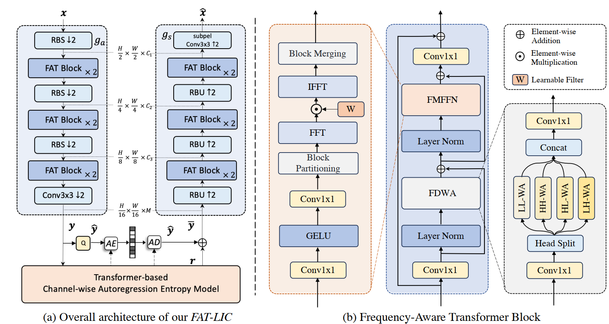
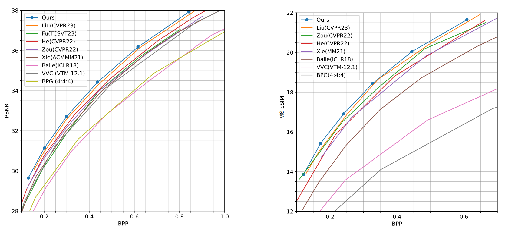

# ICLR2024-Frequency-aware-Transformer-for-Learned-Image-Compression

## Introduction
This repository is the offical [Pytorch](https://pytorch.org/) implementation of [FLIC: Frequency-aware Transformer for Learned Image Compression (ICLR2024)](https://openreview.net/forum?id=HKGQDDTuvZ). 

**Abstract:**
Learned image compression (LIC) has gained traction as an effective solution for image storage and transmission in recent years. However, existing LIC methods are redundant in latent representation due to limitations in capturing anisotropic frequency components and preserving directional details. To overcome these challenges, we propose a novel frequency-aware transformer (FAT) block that for the first time achieves multiscale directional ananlysis for LIC. The FAT block comprises frequency-decomposition window attention (FDWA) modules to capture multiscale and directional frequency components of natural images. Additionally, we introduce frequency-modulation feed-forward network (FMFFN) to adaptively modulate different frequency components, improving rate-distortion performance. Furthermore, we present a transformer-based channel-wise autoregressive (T-CA) model that effectively exploits channel dependencies. Experiments show that our method achieves state-of-the-art rate-distortion performance compared to existing LIC methods, and evidently outperforms latest standardized codec VTM-12.1 by 14.5%, 15.1%, 13.0% in BD-rate on the Kodak, Tecnick, and CLIC datasets.


## Architectures
The overall framework of FLIC.



## RD Results
RD curves on Kodak.



## Dependencies
- python==3.8.17
- PyTorch==1.12.1
- torchvision==0.16.1
- compressai==1.2.4
- range-coder==1.1
- einops
- timm
## Training

``` 
CUDA_VISIBLE_DEVICES='0' python -u ./train.py -d [path of training dataset] \
    --cuda  --lambda 0.0483 --epochs 50  \
    --save_path [path for checkpoint] --save \
    --checkpoint [path of the pretrained checkpoint]
```

## Testing
``` 
python eval.py --checkpoint [path of the pretrained checkpoint] --data [path of testing dataset] --cuda
```

## Pretrained Model
| Lambda | Metric | Link |
|--------|--------|------|
|0.0483   | MSE   |  [ckpt_0483.pth](https://drive.google.com/file/d/1l1vYGo9HOX6_0NR7H1TrVJGW67VgyUV_/view?usp=sharing)  |
|0.0250   | MSE   |  [ckpt_0250.pth](https://drive.google.com/file/d/1W3Ll1cl8-TMMsuqJWQbALxchOvD32oNj/view?usp=sharing)  |
|0.0130   | MSE   |  [ckpt_0130.pth](https://drive.google.com/file/d/1Js0F8LLAJI62tsFZBRtSK6j_nnt_eEkZ/view?usp=sharing)  |
|0.0067   | MSE   |  [ckpt_0067.pth](https://drive.google.com/file/d/15WiSKW-PFnpHaE4nP_IlndiOJHDPS0y8/view?usp=sharing)  |
|0.0035   | MSE   |  [ckpt_0035.pth](https://drive.google.com/file/d/14wIctJRBhYEfxpnprxP03YP4aWAPodL0/view?usp=sharing)  |
|0.0018   | MSE   |  [ckpt_0018.pth](https://drive.google.com/file/d/1Ctikh2P0fLRGJfsiR8JSONZaoAGy-Kha/view?usp=sharing)  |
|60.50   | MS-SSIM  |  [ckpt_0018.pth](https://drive.google.com/file/d/1l1vYGo9HOX6_0NR7H1TrVJGW67VgyUV_/view?usp=sharing)  |
|31.73   | MS-SSIM  |  [ckpt_0018.pth](https://drive.google.com/file/d/1l1vYGo9HOX6_0NR7H1TrVJGW67VgyUV_/view?usp=sharing)  |


## Acknowledgement
Part of our code is borrowed from the following repositories.

- [TCM-LIC](https://github.com/jmliu206/LIC_TCM)
  
- [STF](https://github.com/Googolxx/STF)

## Citation
```
@inproceedings{li2023frequency,
  title={Frequency-Aware Transformer for Learned Image Compression},
  author={Li, Han and Li, Shaohui and Dai, Wenrui and Li, Chenglin and Zou, Junni and Xiong, Hongkai},
  booktitle={The Twelfth International Conference on Learning Representations},
  year={2023}
}
```
